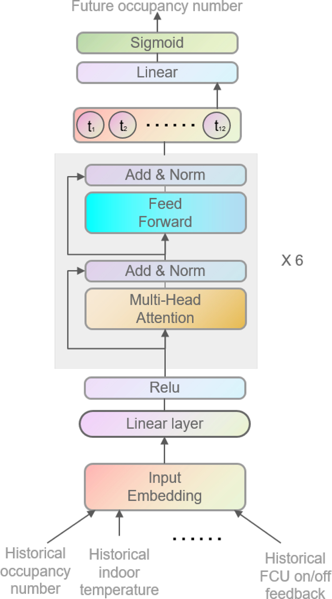

# [Building occupancy number prediction: A Transformer approach](https://www.sciencedirect.com/science/article/pii/S036013232300834X)


 

 [Paper](https://www.sciencedirect.com/science/article/pii/S036013232300834X)
 
The dataset is available at file folders: Original_data (Week-1) and occupanyprediction(Week-2).

## Environment
- The code is tested on Ubuntu 20.04.2, python 3.8, cuda 11.1.


## Installation
 1. Clone this repository
  ```bash
  git clone https://github.com/kailaisun/occprediction
  ```
  
 2. Install 
  ```bash
  pip install -r requirements.txt
  ```
  

## Train and test
### Transformer

```Bash
python multi_source_transformer-copy.py
```

## Citation
```Bash
@article{SUN2023110807,
         title = {Building occupancy number prediction: A Transformer approach},
         author = {Kailai Sun and Irfan Qaisar and Muhammad Arslan Khan and Tian Xing and Qianchuan Zhao},
         journal = {Building and Environment},
         volume = {244},
         pages = {110807},
         year = {2023},
         issn = {0360-1323},
         doi = {https://doi.org/10.1016/j.buildenv.2023.110807}
}
```
## Contact Us

If you have other questions❓, please contact us in time 👬
